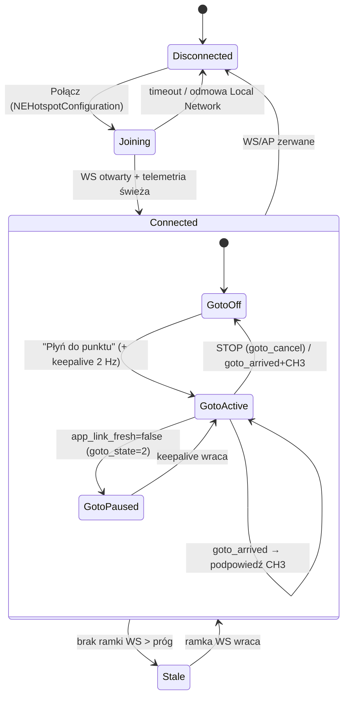

# feat: Aplikacja iOS — mapa offline + tap-to-goto dla silnika kajaka

## Przegląd

Budujemy natywną aplikację iOS (SwiftUI, iPhone, iOS 17+) będącą **cienkim klientem**
gotowego firmware'u ESP32 (`kayak-motor`). Operator dotyka punkt na mapie offline i
każe łódce tam dopłynąć (point-and-shoot), widząc na żywo pozycję i kurs łodzi z
telemetrii WS ~10 Hz. Cała logika ruchu i bezpieczeństwa zostaje w firmware; aplikacja
tylko wysyła jeden cel `lat/lon`, utrzymuje keepalive i pokazuje stan. **MVP brutalnie
chudy** — tylko rdzeń nawigacji + waypointy (zob. źródło: `docs/dev-brainstorms/2026-07-01-ios-app-requirements.md`, „Filozofia MVP").

Projekt startuje od **bramki de-risk** (Unit 0): potwierdzenia, że natywna apka na
realnym iPhonie (aktywne LTE) niezawodnie gada z `192.168.4.1` po Wi‑Fi. Zielone →
reszta planu. Czerwone → stop i rozmowa o BLE (Plan B, poza MVP).

## Ujęcie problemu

Jedyny dziś interfejs silnika to wbudowany panel WWW serwowany z ESP32 (surowe pola,
brak mapy). ESP32 nie uniesie kafelków map (partycja ~580 KB), a na wodzie nie ma
internetu. Operator potrzebuje **mapy** i wygodnego **tap-to-goto** na telefonie, z
offline'owym tłem i podglądem pozycji/kursu na żywo. Panel WWW (Safari, same-origin)
nie dowodzi, że natywna apka (`URLSession`/WebSocket) trafi do `192.168.4.1` — to
osobna ścieżka sieciowa i największe ryzyko projektu (zob. źródło: „Kluczowe
ograniczenia" §1).

## Śledzenie wymagań

Wymagania przeniesione 1:1 z dokumentu źródłowego („Wymagania — MVP", R1–R10):

- **R1.** Łączność z AP silnika: dołączenie do `kayak-motor`, wymuszenie interfejsu
  Wi‑Fi do `192.168.4.1`, uprawnienie local-network, widoczny status połączenia.
- **R2.** Mapa offline: wektorowy kontur akwenu (OSM) + marker łodzi z orientacją wg
  `imu_heading_deg10`, podążanie za łodzią, wskaźnik jakości GPS.
- **R3.** Tap-to-goto: dotknięcie stawia/przesuwa cel; „Płyń do punktu" wysyła `goto`
  z `lat_e7/lon_e7`; pin + linia łódź→cel + `goto_err_m`/`goto_bearing_deg10`.
- **R4.** Waypointy: zapis realnej pozycji GPS łódki jako nazwany punkt (trwały),
  ponowne wysłanie jako cel goto; add/nazwij/usuń. Zero sekwencji/tras.
- **R5.** Podtrzymanie i anulowanie: keepalive `goto` ~2 Hz; blokada auto-lock ekranu
  TYLKO podczas aktywnego goto; po `goto_arrived` podpowiedź CH3; pokazuje
  `goto_state`/`goto_arrived`/`app_link_fresh`.
- **R6.** STOP i Rozbrój: wielki zawsze-widoczny STOP → `goto_cancel` bez potwierdzenia
  i bez rozbrajania; osobny mniejszy „Rozbrój" → `disarm`. App nigdy nie uzbraja.
- **R7.** Miękkie ostrzeżenie „poza akwenem" — potwierdzenie przy celu poza konturem,
  NIE twarda blokada.
- **R8.** Czytelny stan systemu i przyczyny (stan FSM + powód gdy goto nie rusza).
- **R9.** Odporność linku/telemetrii: utrata WS/AP → widoczna, wygaszanie nieświeżych
  danych, wznawianie; pauza goto po utracie linku odzwierciedlona.
- **R10.** Czytelność na wodzie: wysoki kontrast, duże cele, obsługa jedną ręką,
  świadome „Płyń do punktu".

## Granice scope'u (non-goals — MVP)

Przeniesione ze źródła („Granice scope'u"):
- Brak satelity/ortofoto — MVP tylko wektorowy kontur (fotomapa → v1.1).
- Brak pobierania obszarów offline (kontur zaszyty raz w bundlu).
- Brak uzbrajania z aplikacji — arm tylko RC (app: disarm/STOP/cancel).
- Brak twardej blokady geofence — tylko miękkie ostrzeżenie (R7).
- Brak długiego trzymania punktu z apki — długie trzymanie = CH3 z RC.
- Brak tras/sekwencji/autopilota — jeden aktywny cel; waypointy to pojedyncze cele.
- Brak strojenia parametrów z apki (na razie panel WWW).
- iPad, iOS < 17, Android — poza MVP.
- Brak kont/chmury/telemetrii do internetu — wszystko lokalne, offline.

## Kontekst i research

### Kontrakt firmware (zweryfikowany w kodzie — źródło prawdy dla modeli)

Zweryfikowane bezpośrednio w `components/web_panel/src/*` (nie tylko z dokumentu):

- **AP:** SSID `kayak-motor`, WPA2-PSK, hasło `CHANGE-ME-kayak`, kanał 6, **max 1
  klient**, `http://192.168.4.1:80`. Brak CORS, brak auth. (`components/web_panel/src/wifi_ap.c`, `sdkconfig`)
- **WS `GET /ws`** — okres **100 ms (~10 Hz)**, ręcznie serializowany JSON (bez alokacji
  na hot-path), jedna ramka = jeden obiekt. Pełna lista pól i skalowanie w
  `components/web_panel/src/ws_telemetry.c` (`snapshot_to_json`),
  `components/web_panel/include/ws_telemetry.h`. Kluczowe pola i **skalowanie**:
  - `state` int (0=DISARMED, 1=ARMED, 2=FAILSAFE, **3=ESC_CALIBRATION, 4=DEPLOY**) —
    **UWAGA: dokument źródłowy mówił 0-3; realnie 0-4.**
  - `arm_reason` (0=READY,1=NO_RC,2=THROTTLE_NOT_NEUTRAL,3=CALIBRATING,4=SETTINGS_APPLYING)
  - `rc_valid`, `gps_fix`, `imu_ok`, `goto_arrived`, `app_link_fresh` — bool
  - `gps_sats` int, `gps_speed_cms` (cm/s), `imu_heading_deg10` (deg×10, [0,3599])
  - `gps_lat_e7`/`gps_lon_e7`, `goto_target_lat_e7`/`goto_target_lon_e7` (deg×1e7, int32)
  - `goto_state` (0=OFF,1=ACTIVE,2=PAUSED), `goto_err_m` (m), `goto_bearing_deg10` (deg×10)
  - `spot_lock_state` (0=OFF,1=ACTIVE,2=PAUSED) — CH3-driven, osobny od goto
- **Komendy `POST /api/command`** (`components/web_panel/src/command_parse.c`,
  `http_server.c:204`), body ≤ **256 B**, `Content-Type: application/json`:
  - `{"cmd":"goto","lat_e7":<i32>,"lon_e7":<i32>}` — walidacja w domenie double PRZED
    castem; zakres `lat_e7 ∈ [-900000000, 900000000]`, `lon_e7 ∈ [-1800000000, 1800000000]`;
    poza zakresem / NaN / INF / brak pól → **HTTP 400**. (`components/web_panel/include/goto_target.h`)
  - `{"cmd":"goto_cancel"}`, `{"cmd":"disarm"}` (MVP używa tylko tych trzech)
  - **Koperta odpowiedzi** (`components/web_panel/src/api_contract.c`): sukces 200
    `{"data":null,"error":null}`; błąd 400 `{"data":null,"error":{"code":"BAD_REQUEST|VALIDATION_FAILED|NOT_DISARMED","message":"..."}}`.
- **Comms-watchdog** (`components/control_loop/src/control_loop.c`,
  `components/settings/src/settings_ranges.h`): `GOTO_COMMS_TIMEOUT_MS_DEFAULT=1500`
  (zakres 200..5000). `app_link_fresh = (now - last_goto_ms) < timeout`. Utrata linku →
  goto **PAUSED** (cel zachowany, brak sterowania), nigdy disarm. **App musi ponawiać
  `goto` co ≤1500 ms; konserwatywnie ~1000 ms (≈2 Hz).**

### Wiedza instytucjonalna (`docs/solutions/`)

- `docs/solutions/runtime-errors/2026-07-01-goto-app-override-validation-retention.md`:
  firmware waliduje cel w domenie double przed castem (app może wysyłać `double`, ale
  bezpieczniej słać już-zaokrąglony int32); utrata linku = PAUSE z retencją celu
  (transient loss wznawia), NIE abort; latch celu kasuje tylko manualny override/CH3.
  **Implikacja dla apki:** po krótkiej utracie linku wznowienie keepalive `goto`
  ożywia nawigację bez ponownego dotykania mapy; app odzwierciedla PAUSED, nie „udaje"
  postępu.
- Learned-pattern „Nowe źródło sterowania = własny watchdog świeżości, degradacja to
  PAUSE nie abort" — po stronie apki oznacza: keepalive to obowiązek, a nie optymalizacja.

### Referencje zewnętrzne (research 2026)

**Łączność iOS↔AP (de-risk):**
- Kluczowy insight: `192.168.4.1` to adres lokalnego subnetu Wi‑Fi → kernel i tak
  wyśle go po Wi‑Fi (nie po LTE), bo tylko interfejs Wi‑Fi „posiada" ten subnet.
  Realne blokery to: (1) uprawnienie **Local Network** (ciche failowanie po odmowie),
  (2) iOS deprioryzuje/zrzuca „bez-internetową" asocjację Wi‑Fi, (3) WebSocket na
  `URLSession` nie ma pinu interfejsu.
- `URLSession` **nie da się** związać z interfejsem (potwierdzone przez Apple DTS).
  Dla HTTP do literalnego IP zwykle wystarcza `URLSession` (`waitsForConnectivity=true`);
  fallback: `NWConnection` z `requiredInterfaceType=.wifi` + `prohibitExpensivePaths=true`
  (prosty HTTP, tylko drobne request/response).
- **WebSocket:** użyć **Network.framework** (`NWProtocolWebSocket` na `NWConnection`
  pinowanym do `.wifi`), nie `URLSessionWebSocketTask` — daje pin interfejsu + framing.
- `NEHotspotConfiguration(ssid:passphrase:isWEP:false)`, `joinOnce=false`; wymaga
  capability **Hotspot Configuration**. Znany bug DHCP (FB8903217): ~130 s opóźnienia
  asocjacji ~20% prób na niektórych urządzeniach → duże timeouty + fallback „dołącz
  ręcznie w Ustawieniach". `NEHotspotHelper` — niepraktyczny (entitlement na zamówienie).
- `NSLocalNetworkUsageDescription` w Info.plist wymagany; prompt pojawia się przy
  PIERWSZYM realnym połączeniu do lokalnego IP; odmowa = ciche „offline" (brak API do
  odczytu statusu) → ekran-recovery „włącz Local Network w Ustawieniach".
- Źródła: Apple Forums 680485/130921/670825/773942, TN3151, TN3179, docs
  `NWParameters.requiredInterfaceType`, `NSLocalNetworkUsageDescription`.

**MapLibre GL Native iOS (offline):**
- `import MapLibre` (prefix **`MLN*`**, nie legacy `MGL*`/`import Mapbox`). SwiftPM:
  `https://github.com/maplibre/maplibre-gl-native-distribution` v **6.27.0** (binary
  xcframework, moduł `MapLibre`). Renderer Metal; brak buildów bez Xcode.
- SwiftUI: `UIViewRepresentable` wokół `MLNMapView`, delegat w Coordinatorze; wiązanie
  źródeł/warstw w `mapView(_:didFinishLoading:)`.
- **Offline bez serwera kafelków:** bundlowy `blank-style.json` (`"version":8`,
  `"sources":{}`, warstwa `background`) ładowany z `file://`; potem `MLNShapeSource(identifier:url:)`
  na bundlowym `lake.geojson` + `MLNFillStyleLayer`/`MLNLineStyleLayer` (własności przez
  `NSExpression`). Zero requestów sieciowych.
- **Marker łodzi 10 Hz:** `MLNSymbolStyleLayer` z `iconRotation` (deg CW, =`deg10/10`),
  `iconRotationAlignment="map"`; aktualizacja przez podmianę `MLNShapeSource.shape`
  (bufor GPU) — NIE `MLNAnnotationView` (jank/leak przy 10 Hz). Recentrowanie kamery
  ≤1–2 Hz.
- Tap→coord: `MLNMapView.convert(_:toCoordinateFrom:)`. Linia łódź→cel: `MLNPolylineFeature`
  na osobnym `MLNShapeSource`.
- Atrybucja OSM: „© OpenStreetMap contributors" — dodać `attribution` do źródła stylu
  ORAZ stały `Text(...)` overlay (bundlowy GeoJSON nie wypełnia wbudowanego ⓘ).
- Źródła: github maplibre-native + maplibre-gl-native-distribution, maplibre.org iOS
  docs, jawg/maptiler mirrors, style-spec.

## Kluczowe decyzje techniczne

- **Cienki klient, zero duplikacji regulatora** — apka wysyła jeden cel i renderuje
  telemetrię; żadnych bramek bezpieczeństwa/regulacji po stronie apki (są w firmware).
- **Lokalizacja projektu:** podkatalog `ios/KayakMotor/` w tym repo (kontrakt WS/HTTP
  współdzielony). (decyzja użytkownika)
- **Bramka de-risk jako Unit 0** — nic dalej nie ruszamy zanim łączność nie jest
  zielona na realnym iPhonie. (decyzja użytkownika)
- **Framework testów: Swift Testing** (`@Test`/`#expect`) dla czystej logiki (konwersja
  współrzędnych, point-in-polygon, dekodowanie telemetrii, maszyna keepalive). (decyzja
  użytkownika)
- **Transport:** HTTP przez `URLSession` (fallback `NWConnection`/`.wifi`); WS przez
  **Network.framework pinowany do `.wifi`**. Pin interfejsu + `prohibitExpensivePaths`
  = ubezpieczenie na deprioryzację bez-internetowego Wi‑Fi.
- **Konwersja współrzędnych:** `e7 = Int32((deg * 1e7).rounded())`, `deg = Double(e7)/1e7`.
  Wysyłamy już-zaokrąglony `int32` (zgodne z walidacją firmware; unikamy różnic
  round/trunc). Zakres walidowany po stronie apki PRZED wysłaniem (spójny z ±90/±180 e7).
- **Waypointy:** trwały zapis przez `Codable` do pliku w Application Support (albo
  SwiftData); zapisujemy realną pozycję łódki z telemetrii (`gps_lat_e7/lon_e7`).
- **Geofence R7:** jeden bundlowy polygon jeziora; ray-casting point-in-polygon; poza
  polygonem → dialog potwierdzenia. Auto-detekcja wielu jezior → v1.1.
- **Marker offline:** style-layer (`MLNSymbolStyleLayer`) zamiast annotation views.

## Otwarte pytania

### Rozwiązane podczas planowania

- **Konwersja WGS84 ↔ e7** → `Int32((deg*1e7).rounded())` / `Double(e7)/1e7`; wysyłamy int32.
- **Wykrycie „innego akwenu" (R7)** → point-in-polygon względem jednego bundlowego
  konturu; poza → ostrzeżenie. Multi-lake w v1.1 (zgodne z non-goals).
- **`NEHotspotConfiguration` — app czy Ustawienia?** → app próbuje programowo
  (`joinOnce=false`), z fallbackiem „dołącz ręcznie"; niezawodność potwierdza Unit 0.
- **HTTP: `URLSession` czy `NWConnection`?** → domyślnie `URLSession`; przełączamy na
  `NWConnection`/`.wifi` tylko jeśli Unit 0 pokaże flaky. (Interfejs klienta HTTP
  abstrahuje transport, by podmiana nie ruszała warstw wyżej.)
- **WebSocket** → Network.framework pinowany do `.wifi` (decyzja z researchu).
- **Testy framework** → Swift Testing.

### Odroczone do implementacji (executive discovery)

- Realna niezawodność asocjacji Wi‑Fi i ogon buga DHCP ~130 s na docelowym iPhonie
  (mierzone w Unit 0; wpływa na timeouty/retry i UX „dołącz ręcznie").
- Czy `URLSession` wystarcza dla POST do `192.168.4.1`, czy trzeba `NWConnection`
  (rozstrzyga Unit 0).
- Strojenie reconnect WS (backoff, próg wygaszania „stale") — po obserwacji realnego
  strumienia.
- Czy firmware-AP ma odpowiadać na captive-probe Apple (steadier asocjacja vs UI
  captive) — eksperyment w Unit 0; ewentualna zmiana firmware POZA tym planem.
- Dokładny kształt glifu łódki i paleta „słoneczna" — dopięcie w Unit 9.

## Diagram: stany linku i goto (widok apki)

## Implementation Units

Pogrupowane w fazy. Faza 0 bramkuje wszystko. Feature-bearing unity mają ścieżkę
testu (Swift Testing) i, gdzie dotyczy, scenariusz `[E2E]` = **manualna weryfikacja na
urządzeniu** (agent-browser nie steruje iPhonem; E2E to ręczny scenariusz on-device).

### Faza 0 — Bramka de-risk

- [ ] **Unit 0: Bramka łączności (throwaway/minimal app)**

**Cel:** Udowodnić na realnym iPhonie (aktywne LTE), że natywna apka niezawodnie gada
z `192.168.4.1` po Wi‑Fi: join AP → uprawnienie Local Network → HTTP POST → WebSocket,
przy jednoczesnym działającym internecie LTE. Zielone → reszta planu; czerwone → stop
i rozmowa o BLE (Plan B).

**Wymagania:** R1 (fundament).

**Zależności:** Brak.

**Pliki:**
- Stwórz: `ios/DeRiskProbe/` (osobny, minimalny target SwiftUI — celowo throwaway)
- Stwórz: `ios/DeRiskProbe/ProbeApp.swift`, `ContentView.swift`, `ProbeNetworking.swift`
- Konfiguracja: `Info.plist` z `NSLocalNetworkUsageDescription`; capability
  **Hotspot Configuration** (entitlement `com.apple.developer.networking.HotspotConfiguration`)
- Dokument wyniku: `docs/dev-brainstorms/2026-07-01-ios-derisk-gate-results.md` (zapis
  pass/fail + zmierzone czasy join, zachowanie odmowy uprawnienia, flaky? HTTP vs WS)

**Podejście:**
- `NEHotspotConfiguration(ssid:"kayak-motor", passphrase:"CHANGE-ME-kayak", isWEP:false)`,
  `joinOnce=false`, `.apply`; mierzyć czas join (10× — złapać ogon DHCP ~130 s).
- Wyzwolić prompt Local Network świadomie; przetestować ścieżkę ODMOWY + recovery.
- HTTP: `URLSession` POST `http://192.168.4.1/api/command` `{"cmd":"goto_cancel"}`,
  `waitsForConnectivity=true`; równolegle sprawdzić, że request do internetu (LTE) też
  przechodzi. Jeśli flaky → `NWConnection`+`requiredInterfaceType=.wifi`+`prohibitExpensivePaths`.
- WS: Network.framework `NWProtocolWebSocket` na `NWConnection` pinowanym `.wifi` do
  `ws://192.168.4.1/ws`; trzymać otwarty, liczyć ramki ~10 Hz.
- Stress: background 20 s, lock ekranu, wyjście z zasięgu i powrót — czy asocjacja i
  pinowany socket wracają.

**Notatka wykonawcza:** To jest spike/executive-discovery, nie produkcyjny kod —
minimalny, jednorazowy; wynik zapisujemy do dokumentu i podejmujemy decyzję go/no-go.

**Wzorce do naśladowania:** minimalne szkielety z researchu (NWParameters/NWConnection,
NEHotspotConfiguration z Marko Engelman).

**Scenariusze testowe:**
- [E2E] Na urządzeniu z LTE: Połącz → prompt Local Network → POST zwraca 200
  `{"data":null,"error":null}`; równocześnie request do internetu przez LTE działa.
- [E2E] WS otwiera się i strumień ramek ~10 Hz płynie ≥60 s bez rozłączeń w foreground.
- [E2E] Odmowa Local Network → połączenie failuje „cicho" → ekran-recovery kieruje do
  Ustawień (potwierdza znane zachowanie, nie crash).
- [E2E] Background 20 s → powrót → socket reconnectuje (lub jasno widać, że nie —
  wynik do dokumentu).

**Weryfikacja:** Dokument wyników ma jednoznaczne PASS: HTTP POST + WS działają do
`192.168.4.1` przy żywym LTE, asocjacja przeżywa krótkie tło, istnieje działający
fallback manual-join + recovery uprawnienia. Bez PASS — plan zatrzymany na tej bramce.

### Faza 1 — Fundament klienta

- [ ] **Unit 1: Szkielet projektu, zależności, uprawnienia**

**Cel:** Utworzyć produkcyjny projekt Xcode `ios/KayakMotor` (SwiftUI, iOS 17+), dodać
MapLibre (SwiftPM), skonfigurować entitlements/Info.plist i target testów Swift Testing.

**Wymagania:** R1, R2, R10 (baseline UX).

**Zależności:** Unit 0 = PASS.

**Pliki:**
- Stwórz: `ios/KayakMotor/KayakMotor.xcodeproj`, `ios/KayakMotor/App/KayakMotorApp.swift`,
  `ios/KayakMotor/App/RootView.swift`
- Konfiguracja: `Info.plist` (`NSLocalNetworkUsageDescription`), entitlements
  (Hotspot Configuration), deployment target iOS 17, SwiftPM dependency
  `maplibre-gl-native-distribution` (from 6.27.0)
- Stwórz: `ios/KayakMotor/README.md` (jak zbudować, capability, uwaga o realnym
  urządzeniu — MapLibre/hotspot nie działają w Simulatorze)
- Test: `ios/KayakMotorTests/SmokeTests.swift` (Swift Testing — build + app launch smoke)

**Podejście:**
- Struktura folderów: `App/`, `Contract/` (modele), `Networking/`, `Map/`, `Features/`,
  `Persistence/`, `DesignSystem/`.
- Wpiąć MapLibre jako `.product(name:"MapLibre", package:"maplibre-gl-native-distribution")`.
- Ustalić min iOS 17; pinować wersję MapLibre.

**Wzorce do naśladowania:** standardowy layout SwiftUI app; grupowanie per warstwa
(spójne z regułą „jedna odpowiedzialność per moduł").

**Scenariusze testowe:**
- [Unit] Smoke: aplikacja się buduje i startuje (RootView renderuje placeholder).

**Weryfikacja:** Projekt buduje się na urządzeniu; `import MapLibre` linkuje; capability
Hotspot Configuration i klucz Local Network obecne; target testów Swift Testing uruchamia
się zielono.

- [ ] **Unit 2: Modele kontraktu + konwersja współrzędnych (pure, tested)**

**Cel:** Zamodelować dokładny kontrakt WS/HTTP (dekodowanie telemetrii, koperta komend)
i czystą konwersję współrzędnych — całość host-testowalna bez sieci/UI.

**Wymagania:** R2, R3, R8.

**Zależności:** Unit 1.

**Pliki:**
- Stwórz: `ios/KayakMotor/Contract/Telemetry.swift` (`struct Telemetry: Decodable` +
  enumy `SystemState`, `ArmReason`, `GotoState`, `SpotLockState`)
- Stwórz: `ios/KayakMotor/Contract/Command.swift` (`enum Command { case goto(lat_e7,lon_e7), gotoCancel, disarm }`
  + `struct CommandEnvelope: Decodable { data; error }`, `struct ApiError { code; message }`)
- Stwórz: `ios/KayakMotor/Contract/Coordinate.swift` (`toE7(_:Double)->Int32`,
  `fromE7(_:Int32)->Double`, walidacja zakresu ±90/±180 e7)
- Test: `ios/KayakMotorTests/TelemetryDecodingTests.swift`
- Test: `ios/KayakMotorTests/CoordinateConversionTests.swift`
- Test: `ios/KayakMotorTests/CommandEnvelopeTests.swift`
- Fixtures: `ios/KayakMotorTests/Fixtures/telemetry_frame.json`, `command_ok.json`,
  `command_error_400.json`

**Podejście:**
- Enumy z surowymi wartościami dokładnie wg firmware (state 0-4, goto 0-2, arm_reason 0-4);
  nieznane wartości → `.unknown` (dyskryminowany union, nie crash — kontrakt „niezmienny",
  ale bądź odporny na przyszłe pola).
- `imu_heading_deg10 → Double/10`, `gps_speed_cms → m/s` jako computed properties.
- Konwersja: `Int32((deg*1e7).rounded())`; walidacja PRZED wysłaniem (`isValidE7`).
- `Decodable` z tolerancją na nadmiarowe pola (firmware wysyła też `ch*_us`, `servo_us`
  itd. — dekodujemy tylko potrzebne).

**Notatka wykonawcza:** Test-first dla konwersji i dekodowania — czysta logika, wysoka
moc wyroczni.

**Wzorce do naśladowania:** learned-pattern „waliduj w domenie double przed castem"
(spójność z firmware `goto_target_from_double`).

**Scenariusze testowe:**
- [Unit] Dekoduje fixture ramki WS: pola i skalowania (heading deg10→deg, speed cms→m/s)
  poprawne; nieznany `state`=9 → `.unknown` bez crashu.
- [Unit] `toE7(52.2297)` == `522297000`; `fromE7(522297000)` ≈ 52.2297; round-trip stabilny.
- [Unit] **Moc wyroczni:** `toE7` dla `91.0°` (poza ±90) → `isValidE7==false` (test
  FAILuje, jeśli usunąć walidację). Wejście POZA zakresem, nie tożsamość.
- [Unit] Dekoduje kopertę błędu 400 `{"error":{"code":"VALIDATION_FAILED",...}}` na
  `ApiError`; kopertę sukcesu `{"data":null,"error":null}` jako brak błędu.

**Weryfikacja:** Wszystkie testy Contract zielone; usunięcie walidacji zakresu lub
skalowania heading powoduje FAIL (moc wyroczni potwierdzona).

- [ ] **Unit 3: Warstwa sieciowa — join AP, wymuszenie Wi‑Fi, HTTP, WS**

**Cel:** Produkcyjna warstwa transportu na bazie ustaleń Unit 0: dołączanie do AP,
klient HTTP (goto/goto_cancel/disarm) i strumień WS pinowany do `.wifi`, ze stanem
linku jako źródłem prawdy dla UI.

**Wymagania:** R1, R9.

**Zależności:** Unit 0 (wynik go/no-go i wybór HTTP transportu), Unit 2 (modele).

**Pliki:**
- Stwórz: `ios/KayakMotor/Networking/HotspotJoiner.swift` (`NEHotspotConfiguration` +
  fallback „dołącz ręcznie")
- Stwórz: `ios/KayakMotor/Networking/CommandClient.swift` (protokół `CommandSending`;
  impl `URLSession`; miejsce na `NWConnection` fallback za tym samym protokołem)
- Stwórz: `ios/KayakMotor/Networking/TelemetrySocket.swift` (Network.framework
  `NWProtocolWebSocket` pinowany `.wifi`, reconnect z backoff)
- Stwórz: `ios/KayakMotor/Networking/LinkState.swift` (`enum LinkState { disconnected,
  joining, connected, stale }` — dyskryminowany union, nie boolean flags)
- Test: `ios/KayakMotorTests/CommandClientTests.swift` (mock transportu — buduje poprawny
  URL/body/nagłówki; mapuje 400→`ApiError`)
- Test: `ios/KayakMotorTests/LinkStateMachineTests.swift`

**Podejście:**
- `CommandClient` buduje `POST http://192.168.4.1/api/command`, `Content-Type: application/json`,
  body ≤256 B; mapuje status: 200→ok(data/error==null), 400→`ApiError`; sieć-błąd →
  typed error (nie string). Wysyła już-zaokrąglony `lat_e7/lon_e7` (int32).
- `TelemetrySocket`: pin `.wifi` + `prohibitExpensivePaths`; parsuje ramki na `Telemetry`;
  publikuje przez `AsyncStream`/Combine; reconnect z backoff; sygnalizuje `stale` gdy
  brak ramki > próg.
- **Zgodnie z regułami async:** reconnect/timeouty z jawnym cleanup; wzajemnie wykluczające
  się operacje (join vs reconnect) serializowane.
- Mockujemy TYLKO transport (URLSession/NWConnection) — nie logikę budowania żądań.

**Notatka wykonawcza:** Transport za protokołem, by wynik Unit 0 (URLSession vs
NWConnection) był podmianą jednej implementacji bez ruszania warstw wyżej.

**Wzorce do naśladowania:** learned-pattern „nowe źródło sterowania = własny watchdog
świeżości, degradacja = PAUSE nie abort" (po stronie apki: `stale`/reconnect, nie panika).

**Scenariusze testowe:**
- [Unit] `goto(lat,lon)` → poprawny URL, `Content-Type`, body `{"cmd":"goto","lat_e7":..,"lon_e7":..}`.
- [Unit] Odpowiedź 400 z `error.code` → rzuca/zwraca typed `ApiError`, nie ignoruje.
- [Unit] Maszyna LinkState: brak ramki > próg → `stale`; ramka wraca → `connected`;
  zerwanie → `disconnected`. **Moc wyroczni:** usunięcie progu stale → test „stale"
  FAILuje.
- [E2E] Na urządzeniu: Połącz łączy z `kayak-motor`, WS zaczyna publikować telemetrię.

**Weryfikacja:** Testy jednostkowe zielone; na urządzeniu status linku odzwierciedla
realny stan (connected/stale/disconnected), a goto_cancel wraca 200.

- [ ] **Unit 4: Store telemetrii + bramkowanie świeżości + status/HUD (stan i przyczyny)**

**Cel:** Obserwowalny store (`@Observable`) konsumujący strumień WS, wygaszający
nieświeże dane oraz HUD pokazujący stan FSM i — gdy goto nie rusza — czytelny powód.

**Wymagania:** R2, R8, R9.

**Zależności:** Unit 3.

**Pliki:**
- Stwórz: `ios/KayakMotor/Features/Telemetry/TelemetryStore.swift` (`@Observable`;
  ostatnia ramka + `isStale`)
- Stwórz: `ios/KayakMotor/Features/Telemetry/GotoReadiness.swift` (czysta funkcja:
  `(Telemetry)->GotoBlockReason?` — brak ARMED / brak fixu / drążki / brak linku)
- Stwórz: `ios/KayakMotor/Features/Telemetry/StatusHUDView.swift` (stan, gps_fix/sats,
  prędkość, `app_link_fresh`, powód blokady)
- Test: `ios/KayakMotorTests/GotoReadinessTests.swift`
- Test: `ios/KayakMotorTests/TelemetryStaleTests.swift`

**Podejście:**
- `GotoReadiness` mapuje telemetrię na powód: `state != ARMED` → „Uzbrój na RC";
  `!gps_fix` → „Brak fixu GPS"; `arm_reason==THROTTLE_NOT_NEUTRAL` → „Drążki nie w
  neutralu"; `!app_link_fresh` → „Brak linku". Priorytet powodów ustalony i testowany.
- `isStale`: brak świeżej ramki > próg → HUD wygasza wartości (nie „udaje żywych").
- Store nie liczy nawigacji — tylko prezentuje.

**Notatka wykonawcza:** `GotoReadiness` test-first (czysta funkcja, moc wyroczni).

**Wzorce do naśladowania:** firmware `arm_reason`/`app_link_fresh` jako źródło powodów
(nie zgadujemy po stronie apki).

**Scenariusze testowe:**
- [Unit] ARMED + fix + link + neutral → `nil` (goto gotowe).
- [Unit] DISARMED → „Uzbrój na RC"; fix=false → „Brak fixu"; link=false → „Brak linku"
  (priorytet zgodny z ustaleniem). **Moc wyroczni:** telemetria, która bez bramki
  „przeciekłaby" (np. DISARMED ale fix ok) → musi zwrócić powód, nie `nil`.
- [Unit] Brak ramki > próg → `isStale==true`.

**Weryfikacja:** HUD na urządzeniu pokazuje stan i powód; po zerwaniu WS dane widocznie
wygasają; testy readiness/stale zielone.

### Faza 2 — Mapa i nawigacja

- [ ] **Unit 5: Mapa offline (kontur + marker łodzi + jakość GPS)**

**Cel:** Renderować offline'ową mapę MapLibre: bundlowy kontur akwenu jako tło, marker
łodzi na `gps_lat/lon` z orientacją `imu_heading_deg10`, podążanie za łodzią i atrybucję
OSM.

**Wymagania:** R2, R10.

**Zależności:** Unit 4 (telemetria), Unit 1 (MapLibre).

**Pliki:**
- Stwórz: `ios/KayakMotor/Map/LakeMapView.swift` (`UIViewRepresentable` + Coordinator)
- Stwórz: `ios/KayakMotor/Map/MapStyle.swift` (ładowanie `blank-style.json`, wiązanie
  warstw)
- Zasoby: `ios/KayakMotor/Resources/blank-style.json`, `Resources/lake.geojson`
  (kontur OSM `natural=water`, atrybucja ODbL), `Resources/boat-icon` (glif „dziób w górę")
- Stwórz: `ios/KayakMotor/Map/AttributionOverlay.swift` (stały „© OpenStreetMap contributors")
- Test: `ios/KayakMotorTests/MapStyleResourcesTests.swift` (bundlowe zasoby istnieją i
  parsują się; GeoJSON to poprawny FeatureCollection z polygonem)

**Podejście:**
- `styleURL` = bundlowy `blank-style.json` (`"sources":{}`, warstwa `background`) — zero
  sieci. W `didFinishLoading`: `MLNShapeSource(identifier:url:)` na `lake.geojson` +
  `MLNFillStyleLayer`/`MLNLineStyleLayer` (własności przez `NSExpression`).
- Marker: `MLNSymbolStyleLayer` z `iconRotation=NSExpression(forKeyPath:"heading")`,
  `iconRotationAlignment="map"`; aktualizacja przez podmianę `MLNShapeSource.shape` w
  `updateUIView` (bufor GPU). Recentrowanie kamery ≤1–2 Hz (nie 10 Hz).
- `heading = Double(imu_heading_deg10)/10`. Jakość GPS (`gps_fix/sats/speed`) w rogu.
- Atrybucja: `attribution` na źródle stylu + stały overlay `Text`.

**Notatka wykonawcza:** Zapewnić „truly offline" — żaden sprite/glyph/tile URL nie
wskazuje na http; ikona łódki przez `style.setImage` w kodzie.

**Wzorce do naśladowania:** research MapLibre (UIViewRepresentable + Coordinator,
symbol layer 10 Hz przez podmianę shape).

**Scenariusze testowe:**
- [Unit] `lake.geojson` i `blank-style.json` są w bundlu i parsują się; GeoJSON zawiera
  polygon (walidacja struktury).
- [E2E] Na urządzeniu BEZ internetu (AP): kontur renderuje się, marker łodzi pojawia się
  na pozycji GPS i obraca zgodnie z kursem; brak requestów sieciowych (Instruments/Charles
  lub tryb samolotowy + AP).
- [E2E] Marker aktualizuje się płynnie przy strumieniu ~10 Hz (brak janku), kamera podąża.

**Weryfikacja:** Na wodzie/bez internetu mapa i pozycja/kurs żyją; atrybucja OSM widoczna;
zero ruchu sieciowego wychodzącego.

- [ ] **Unit 6: Tap-to-goto (pin, linia, wysłanie celu, err/bearing)**

**Cel:** Dotknięcie mapy stawia/przesuwa cel; „Płyń do punktu" wysyła `goto`; na mapie
pin celu + linia łódź→cel + odległość/namiar z telemetrii.

**Wymagania:** R3.

**Zależności:** Unit 5 (mapa), Unit 3 (CommandClient), Unit 4 (readiness).

**Pliki:**
- Stwórz: `ios/KayakMotor/Features/Goto/GotoTargetController.swift` (stan celu: brak/
  postawiony/wysłany; źródło mapy vs waypoint)
- Modyfikuj: `ios/KayakMotor/Map/LakeMapView.swift` (tap→coord; warstwy pin + polyline
  łódź→cel na osobnym `MLNShapeSource`)
- Stwórz: `ios/KayakMotor/Features/Goto/GotoControlsView.swift` (przycisk „Płyń do
  punktu" — świadome wysłanie; odległość `goto_err_m`, namiar `goto_bearing_deg10`)
- Test: `ios/KayakMotorTests/GotoTargetControllerTests.swift`

**Podejście:**
- Tap: `convert(_:toCoordinateFrom:)` → WGS84 → `toE7`; walidacja zakresu PRZED
  wysłaniem; nowy cel zastępuje poprzedni (jeden aktywny cel).
- „Płyń do punktu" → `CommandClient.goto(lat_e7,lon_e7)`; sukces → cel „wysłany".
  Przycisk celowo osobny od dotknięcia (R10 — brak przypadkowego startu).
- Pin + polyline: osobny `MLNShapeSource` (`MLNPolylineFeature([boat,target])`),
  aktualizacja przez podmianę shape.
- `goto_err_m`/`goto_bearing_deg10` z telemetrii (nie liczymy sami).

**Wzorce do naśladowania:** research MapLibre (tap→coord, polyline source).

**Scenariusze testowe:**
- [Unit] Postawienie celu ustawia współrzędne; drugi tap zastępuje (jeden cel).
- [Unit] Cel poza ±90/±180 → odrzucony przed wysłaniem (spójność z walidacją firmware).
- [Unit] Po sukcesie `goto` stan celu = „wysłany"; po 400 → stan błędu z komunikatem
  (nie ciche zignorowanie).
- [E2E] Dotknięcie punktu → pin + linia; „Płyń do punktu” (gdy ARMED+fix+neutral) →
  nawigacja rusza, `goto_err_m` maleje, `goto_state=1`.

**Weryfikacja:** Na urządzeniu tap stawia cel, wysłanie startuje goto, malejąca odległość
i linia widoczne; nieprawidłowy cel nie jest wysłany.

- [ ] **Unit 7: Keepalive + STOP/Rozbrój + idle-timer + arrived→CH3**

**Cel:** Utrzymywać goto keepalive ~2 Hz podczas aktywnego przejazdu, blokować auto-lock
TYLKO wtedy, pokazywać `goto_state`/`goto_arrived`/pauzę, po dotarciu podpowiadać CH3
oraz zapewnić STOP (goto_cancel) i osobny Rozbrój (disarm).

**Wymagania:** R5, R6.

**Zależności:** Unit 6.

**Pliki:**
- Stwórz: `ios/KayakMotor/Features/Goto/KeepaliveController.swift` (timer ~2 Hz,
  ponawia ostatni cel gdy goto aktywne; cleanup przy STOP/deinit/tło)
- Stwórz: `ios/KayakMotor/Features/Goto/SafetyControlsView.swift` (wielki STOP zawsze
  widoczny; osobny mniejszy „Rozbrój")
- Modyfikuj: `ios/KayakMotor/App/RootView.swift` (`UIApplication.isIdleTimerDisabled`
  tylko podczas aktywnego goto)
- Stwórz: `ios/KayakMotor/Features/Goto/ArrivalHintView.swift` (po `goto_arrived` →
  „Włącz CH3 na RC do trzymania")
- Test: `ios/KayakMotorTests/KeepaliveControllerTests.swift`

**Podejście:**
- Keepalive resend co ~1000 ms (< 1500 ms watchdog), TYLKO gdy `goto_state∈{active,
  paused}` i mamy cel; zatrzymanie natychmiast po STOP. Zgodnie z regułami async: jawny
  cleanup timera (deinit/tło/STOP), brak wycieków.
- STOP → `goto_cancel` natychmiast, bez potwierdzenia, BEZ disarm (silnik uzbrojony,
  operator przejmuje RC). Rozbrój → `disarm` (kill). **App nigdy nie uzbraja.**
- Idle-timer OFF tylko w aktywnym goto (pauza/OFF → przywróć auto-lock).
- Pauza (`goto_state=2` / `app_link_fresh=false`) widoczna; po powrocie keepalive
  wznawia (firmware retencjonuje cel — nie trzeba ponownie dotykać mapy).
- `goto_arrived` → podpowiedź CH3 (aplikacja wozi, RC trzyma).

**Notatka wykonawcza:** Keepalive to obowiązek bezpieczeństwa UX (przypadkowa pauza nie
może zatrzymać łódki w połowie) — test maszyny keepalive test-first.

**Wzorce do naśladowania:** learned-pattern retencji celu w PAUSED (transient loss
wznawia); reguły async (cleanup timerów).

**Scenariusze testowe:**
- [Unit] Gdy goto aktywne → keepalive wysyła cel w interwale < watchdog; po STOP →
  natychmiast przestaje. **Moc wyroczni:** usunięcie warunku „tylko gdy aktywne" →
  test „STOP zatrzymuje keepalive" FAILuje.
- [Unit] STOP wywołuje `goto_cancel`, NIE `disarm`; Rozbrój wywołuje `disarm`.
- [Unit] Idle-timer: włączenie tylko podczas active; pauza/OFF przywraca.
- [E2E] Podczas goto ekran nie gaśnie; STOP natychmiast przerywa; po symulowanej utracie
  linku widać pauzę, po powrocie wznawia; po dotarciu pojawia się podpowiedź CH3.

**Weryfikacja:** Na urządzeniu keepalive utrzymuje `app_link_fresh=true` w ruchu; STOP i
Rozbrój działają natychmiast i rozłącznie; ekran blokuje auto-lock tylko w goto.

### Faza 3 — Waypointy i barierki

- [ ] **Unit 8: Waypointy (zapis realnej pozycji, trwała lista, re-send)**

**Cel:** „Zapisz tę pozycję" zapisuje realną pozycję GPS łódki jako nazwany waypoint w
trwałej pamięci telefonu; dotknięcie waypointu z listy → aktywny cel goto; add/nazwij/
usuń. Zero tras/sekwencji.

**Wymagania:** R4.

**Zależności:** Unit 6 (mechanizm celu), Unit 4 (telemetria pozycji).

**Pliki:**
- Stwórz: `ios/KayakMotor/Persistence/Waypoint.swift` (`struct Waypoint: Codable {id;
  name; lat_e7; lon_e7; createdAt}`)
- Stwórz: `ios/KayakMotor/Persistence/WaypointStore.swift` (`Codable`→plik w Application
  Support; add/rename/delete; przeżywa restart)
- Stwórz: `ios/KayakMotor/Features/Waypoints/WaypointListView.swift` (lista, „Zapisz tę
  pozycję", tap→cel)
- Test: `ios/KayakMotorTests/WaypointStoreTests.swift`

**Podejście:**
- „Zapisz tę pozycję" bierze `gps_lat_e7/lon_e7` z ostatniej świeżej telemetrii (nie
  pozycję mapy) — zgodnie z R4 „realna pozycja łódki". Blokada zapisu gdy brak fixu.
- Trwałość: `Codable` JSON w `FileManager` Application Support (atomic write). SwiftData
  to opcja, ale prosty plik = mniej złożoności (reguła „duplication > complexity”).
- Tap waypointu → ustawia cel goto (zastępuje poprzedni), reuse `GotoTargetController`.

**Notatka wykonawcza:** Store test-first (round-trip trwałości = moc wyroczni: po
„restarcie" store czyta te same waypointy).

**Wzorce do naśladowania:** `GotoTargetController` (jeden aktywny cel; waypoint to
kolejne źródło celu, nie trasa).

**Scenariusze testowe:**
- [Unit] Add→save→reload store zwraca ten sam waypoint (trwałość). **Moc wyroczni:**
  bez realnego zapisu do pliku reload zwraca pustą listę → test FAILuje.
- [Unit] Rename/delete mutują listę i utrwalają.
- [Unit] „Zapisz tę pozycję" przy braku fixu → odrzucone (nie zapisuje 0,0).
- [E2E] Zapis pozycji łódki → restart apki → waypoint nadal na liście → tap wysyła goto.

**Weryfikacja:** Waypointy przeżywają restart; tap re-wysyła cel; brak możliwości
zapisania pozycji bez fixu.

- [ ] **Unit 9: Miękkie ostrzeżenie geofence (R7) + polish słoneczny (R10)**

**Cel:** Przy celu poza bundlowym konturem pokazać ostrzeżenie z potwierdzeniem (NIE
twarda blokada) oraz dopiąć czytelność na wodzie (wysoki kontrast, duże cele, jedna ręka).

**Wymagania:** R7, R10.

**Zależności:** Unit 6 (postawienie celu), Unit 5 (kontur).

**Pliki:**
- Stwórz: `ios/KayakMotor/Features/Goto/WaterGeofence.swift` (czysty ray-casting
  point-in-polygon względem `lake.geojson`)
- Modyfikuj: `ios/KayakMotor/Features/Goto/GotoControlsView.swift` (dialog potwierdzenia
  gdy cel poza konturem)
- Stwórz: `ios/KayakMotor/DesignSystem/SunlightTheme.swift` (kontrast, rozmiary celów,
  układ pod jedną rękę)
- Test: `ios/KayakMotorTests/WaterGeofenceTests.swift`

**Podejście:**
- Point-in-polygon (ray casting) na współrzędnych konturu; poza → `.confirmDialog`
  („punkt wygląda na ląd/poza jeziorem — na pewno?"). Potwierdzenie → wyślij mimo to.
  **Nigdy nie blokuje twardo** (kontur OSM bywa niedokładny; twarda blokada = fałszywe
  poczucie bezpieczeństwa).
- Polish: duże cele dotykowe (STOP największy), wysoki kontrast, elementy sterujące w
  zasięgu kciuka; świadome „Płyń do punktu".

**Notatka wykonawcza:** Point-in-polygon test-first — wejścia wewnątrz/na krawędzi/na
zewnątrz (moc wyroczni: punkt na lądzie MUSI zwrócić „poza").

**Wzorce do naśladowania:** dokument źródłowy R7 (barierka UX, nie failsafe).

**Scenariusze testowe:**
- [Unit] Punkt wewnątrz polygonu → brak ostrzeżenia; punkt poza → ostrzeżenie.
  **Moc wyroczni:** usunięcie testu poza-polygonem (zawsze „wewnątrz") FAILuje na punkcie
  lądowym. Uwzględnić punkt na krawędzi.
- [Unit] Ostrzeżenie NIE blokuje — po potwierdzeniu cel jest wysłany (bezpieczeństwo w
  firmware/RC, nie w apce).
- [E2E] Dotknięcie lądu → dialog; potwierdzenie → goto rusza mimo to.

**Weryfikacja:** Cel na lądzie wyzwala potwierdzenie, ale nie blokuje; UI czytelne przy
słońcu i obsługiwalne jedną ręką.

## Wpływ systemowy

- **Graf interakcji:** WS `TelemetrySocket` → `TelemetryStore` → (HUD, mapa, readiness,
  keepalive, waypoint „zapisz"). `CommandClient` konsumowany przez goto/keepalive/STOP/
  Rozbrój. `HotspotJoiner` inicjuje link. Wszystko cienkie — brak logiki regulatora.
- **Propagacja błędów:** transport → typed error (`ApiError`/network) → warstwa UI
  pokazuje powód; NIGDY pusty catch. 400 z firmware = komunikat, nie ciche zignorowanie.
- **Ryzyka cyklu życia stanu:** keepalive timer (cleanup przy STOP/tło/deinit); idle-timer
  przywracany poza goto; WS reconnect bez wycieków; waypoint atomic write. „Stale”
  telemetria nie może „udawać żywej".
- **Parytet surface:** brak drugiego interfejsu w apce; panel WWW (ESP32) pozostaje
  osobnym, niezależnym klientem tego samego kontraktu (max 1 klient AP — nie łączyć obu
  naraz).
- **Pokrycie integracyjne:** realny link Wi‑Fi, strumień 10 Hz, pauza/wznowienie goto,
  offline mapa — weryfikowane [E2E] na urządzeniu (host-testy tego nie udowodnią).

## Ryzyka i zależności

- **Ryzyko binarne (Unit 0):** jeśli natywna apka nie trafi niezawodnie do
  `192.168.4.1` przy AP bez internetu → Plan B = BLE (dotyka firmware, POZA MVP). Cały
  plan zależny od zielonej bramki.
- **Bug DHCP iOS (~130 s, ~20% prób):** duże timeouty + fallback manual-join; UX nie może
  zakładać natychmiastowej asocjacji.
- **Deprioryzacja bez-internetowego Wi‑Fi:** mitygacja = pin `.wifi` +
  `prohibitExpensivePaths`; foreground podczas sterowania.
- **MapLibre tylko na realnym Xcode/urządzeniu** (binary xcframework; Simulator ograniczony
  dla hotspot/WS) — testy E2E wymagają iPhone'a.
- **Kontrakt firmware „niezmienny w MVP"** — modele dekodują tolerancyjnie (nieznane pola/
  wartości nie crashują), ale zakładamy stabilność `gps_*`/`goto_*`/`imu_*`.
- **Max 1 klient AP** — nie trzymać panelu WWW i apki połączonych jednocześnie.

## Dokumentacja / Notatki operacyjne

- Zapisać wynik bramki de-risk do `docs/dev-brainstorms/2026-07-01-ios-derisk-gate-results.md`
  (go/no-go, zmierzone czasy, wybór HTTP transportu).
- `ios/KayakMotor/README.md`: build na urządzeniu, wymagane capability/Info.plist,
  procedura połączenia z AP, uwaga o Simulatorze.
- Po ukończeniu: kandydat do `/dev-compound` (wzorce iOS↔lokalny-AP, offline MapLibre)
  i aktualizacja auto-memory `ios-app-goto-direction`.

## Źródła i referencje

- **Dokument źródłowy:** [docs/dev-brainstorms/2026-07-01-ios-app-requirements.md](../dev-brainstorms/2026-07-01-ios-app-requirements.md)
- Kontrakt firmware (kod): `components/web_panel/src/ws_telemetry.c`, `command_parse.c`,
  `api_contract.c`, `http_server.c`, `wifi_ap.c`; `components/web_panel/include/goto_target.h`;
  `components/control_loop/src/control_loop.c`; `components/settings/src/settings_ranges.h`
- Wiedza instytucjonalna: `docs/solutions/runtime-errors/2026-07-01-goto-app-override-validation-retention.md`
- Powiązany plan firmware: `docs/plans/2026-07-01-001-feat-goto-waypoint-navigation-plan.md`
- iOS łączność: Apple Forums 680485/130921/670825/773942; TN3151; TN3179; docs
  `NWParameters.requiredInterfaceType`, `NSLocalNetworkUsageDescription`
- MapLibre: github.com/maplibre/maplibre-native, github.com/maplibre/maplibre-gl-native-distribution
  (v6.27.0), maplibre.org iOS docs, maplibre-style-spec
